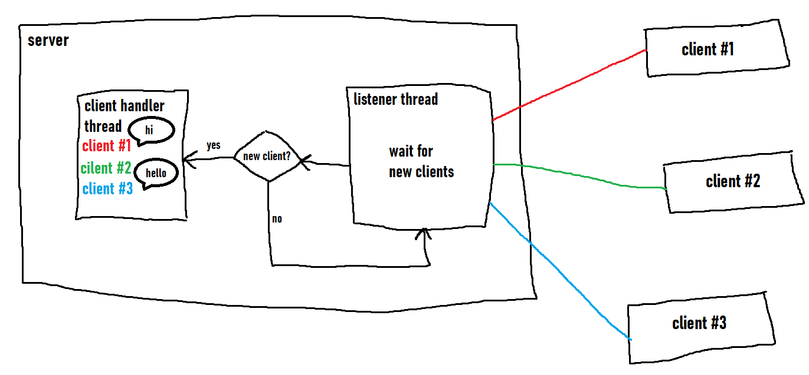

# NaCa (WIP)

^^^architecture (supremely scuffed)^^^

## Table of Contents
* [General info](#general-info)
* [Technologies](#technologies)
* [Setup](#setup)
* [Authors](#authors)

## General Info
NaCa (Not another chat app) is a simple, terminal-based chat app written in Java. I've started this project to learn the fundamentals of network programming such as streams, servers/clients, threads and sockets.

## Technologies
* Java

## Setup
This chat app only works on local host. After cloning the repository, create two terminals. Run `java Chat server` in one terminal and `java Chat client` in the other. If successful, you will be able to send messages from the client which will appear on the server :)

## Author
* Falah Rasyidi